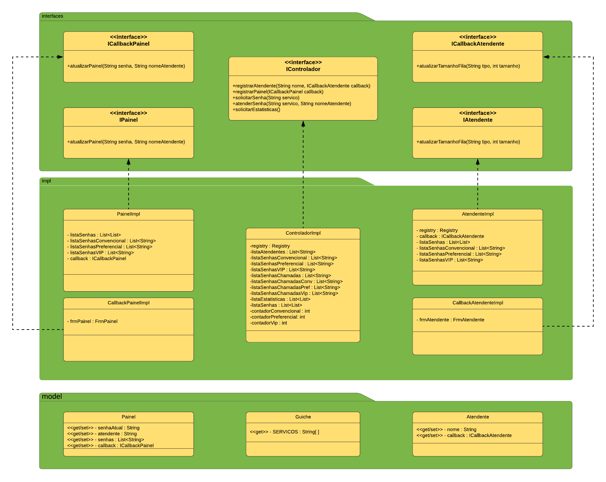
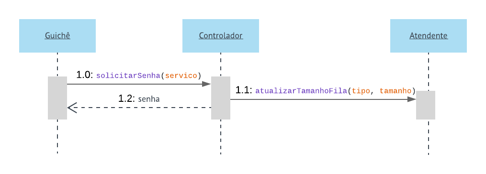
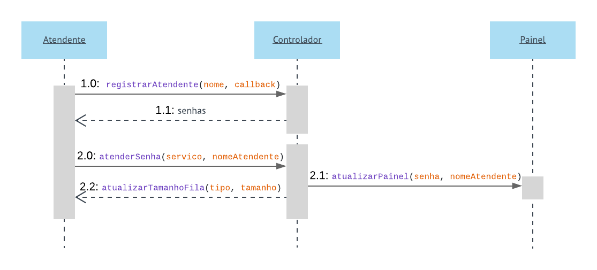

# Jean Felipe Peiter e João Antonio de Oliveira
  
O sistema é iniciado pelo FrmServidor, onde no menu de Iniciar > Painel (Ctrl + P), é iniciado um painel para mostrar as senhas futuramente chamadas e seus respectivos atendentes, e um histórico da senhas que foram chamadas anteriormente.
  
Após iniciar o Painel, é iniciado o Painel de Atendentes (Ctrl + A, no menu de Iniciar), o qual solicitará o nome do atentente, posteriormente abrindo a tela de atendimento de senhas.
  
Após o Painel, pode ser iniciado o Guichê (Ctrl + G, no menu de Iniciar), o qual é uma tela com três botões, para solicitar uma senha de atendimento, com os serviços do tipo Convencional, Preferencial e VIP.
  

  
  
  
  
  
  
  
  
